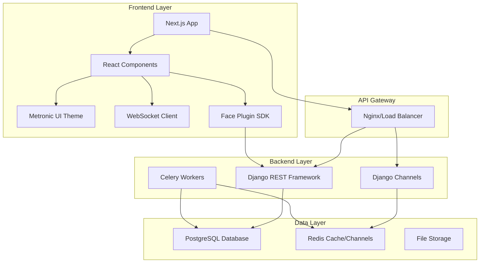

# Design Document

## Overview

Admire HRMS is designed as a modern, scalable, multi-tenant Human Resource Management System using a decoupled architecture. The frontend is built with Next.js and TypeScript for a responsive, real-time user experience, while the backend uses Django REST Framework to provide robust APIs. The system integrates biometric face recognition for attendance, implements comprehensive RBAC, and supports real-time updates through WebSocket connections.

## Architecture

### High-Level Architecture



### Technology Stack

**Frontend:**
- Next.js 14+ with TypeScript for SSR/SSG capabilities
- React 18+ with hooks for state management
- Metronic template for consistent UI/UX
- Tailwind CSS for utility-first styling
- Recharts for data visualization
- Socket.io-client for WebSocket connections
- Face Plugin SDK for biometric integration

**Backend:**
- Django 4.2+ with Django REST Framework
- Django Channels for WebSocket support
- Redis for caching and channel layers
- Celery for background task processing
- PostgreSQL for primary database
- JWT authentication via djangorestframework-simplejwt

## Components and Interfaces

### Frontend Components

#### Core Layout Components
```typescript
// Layout structure
interface LayoutProps {
  children: React.ReactNode;
  user: User;
  permissions: Permission[];
}

// Navigation component with RBAC
interface NavigationProps {
  userRole: Role;
  permissions: Permission[];
  activeModule: string;
}
```

#### Module-Specific Components
```typescript
// Employee Management
interface EmployeeListProps {
  employees: Employee[];
  filters: EmployeeFilters;
  onEdit: (id: string) => void;
  onDelete: (id: string) => void;
}

// Attendance Management
interface AttendanceTerminalProps {
  onFaceCapture: (biometricData: BiometricData) => void;
  isProcessing: boolean;
  lastCheckIn?: AttendanceRecord;
}

// Dashboard Components
interface DashboardWidgetProps {
  title: string;
  value: number | string;
  trend?: number;
  realTimeUpdate: boolean;
}
```

### Backend API Structure

#### Authentication Endpoints
```python
# /api/v1/auth/
POST /login/          # JWT token generation
POST /refresh/        # Token refresh
POST /logout/         # Token invalidation
GET  /profile/        # Current user profile
```

#### Core Module Endpoints
```python
# Employee Management
GET    /api/v1/employees/              # List employees
POST   /api/v1/employees/              # Create employee
GET    /api/v1/employees/{id}/         # Get employee details
PUT    /api/v1/employees/{id}/         # Update employee
DELETE /api/v1/employees/{id}/         # Delete employee

# Attendance Management
POST   /api/v1/attendance/check-in/    # Face recognition check-in
POST   /api/v1/attendance/check-out/   # Face recognition check-out
GET    /api/v1/attendance/             # List attendance records
GET    /api/v1/attendance/reports/     # Attendance reports

# Leave Management
GET    /api/v1/leave/requests/         # List leave requests
POST   /api/v1/leave/requests/         # Create leave request
PUT    /api/v1/leave/requests/{id}/    # Update leave request
POST   /api/v1/leave/approve/{id}/     # Approve leave
POST   /api/v1/leave/reject/{id}/      # Reject leave

# Payroll Management
GET    /api/v1/payroll/                # List payroll records
POST   /api/v1/payroll/generate/       # Generate payroll
GET    /api/v1/payroll/slips/{id}/     # Get payslip
POST   /api/v1/payroll/bulk-process/   # Bulk payroll processing

# User Management
GET    /api/v1/users/                  # List users
POST   /api/v1/users/                  # Create user
GET    /api/v1/roles/                  # List roles
POST   /api/v1/roles/                  # Create role
GET    /api/v1/departments/            # List departments
POST   /api/v1/departments/            # Create department
```

### WebSocket Events

#### Real-time Event Structure
```python
# Attendance events
{
    "type": "attendance.update",
    "data": {
        "employee_id": "uuid",
        "action": "check_in|check_out",
        "timestamp": "ISO datetime",
        "location": "terminal_id"
    }
}

# Leave request events
{
    "type": "leave.status_change",
    "data": {
        "request_id": "uuid",
        "status": "approved|rejected|pending",
        "employee_id": "uuid",
        "approver_id": "uuid"
    }
}

# Dashboard updates
{
    "type": "dashboard.metrics_update",
    "data": {
        "present_count": 150,
        "on_leave_count": 5,
        "pending_requests": 3,
        "timestamp": "ISO datetime"
    }
}
```

## Data Models

### Core Entity Models

#### User and Authentication
```python
class Company(models.Model):
    id = models.UUIDField(primary_key=True, default=uuid.uuid4)
    name = models.CharField(max_length=255)
    code = models.CharField(max_length=50, unique=True)
    settings = models.JSONField(default=dict)
    created_at = models.DateTimeField(auto_now_add=True)

class User(AbstractUser):
    id = models.UUIDField(primary_key=True, default=uuid.uuid4)
    company = models.ForeignKey(Company, on_delete=models.CASCADE)
    employee = models.OneToOneField('Employee', null=True, blank=True)
    role = models.ForeignKey('Role', on_delete=models.PROTECT)

class Role(models.Model):
    id = models.UUIDField(primary_key=True, default=uuid.uuid4)
    name = models.CharField(max_length=100)
    permissions = models.ManyToManyField('Permission')
    company = models.ForeignKey(Company, on_delete=models.CASCADE)
```

#### Employee Management
```python
class Department(models.Model):
    id = models.UUIDField(primary_key=True, default=uuid.uuid4)
    name = models.CharField(max_length=255)
    company = models.ForeignKey(Company, on_delete=models.CASCADE)
    parent = models.ForeignKey('self', null=True, blank=True)

class Employee(models.Model):
    id = models.UUIDField(primary_key=True, default=uuid.uuid4)
    employee_id = models.CharField(max_length=50)
    first_name = models.CharField(max_length=100)
    last_name = models.CharField(max_length=100)
    email = models.EmailField()
    department = models.ForeignKey(Department, on_delete=models.PROTECT)
    company = models.ForeignKey(Company, on_delete=models.CASCADE)
    biometric_data = models.JSONField(null=True, blank=True)
    hire_date = models.DateField()
    status = models.CharField(max_length=20, choices=EMPLOYEE_STATUS_CHOICES)
```

#### Attendance System
```python
class AttendanceRecord(models.Model):
    id = models.UUIDField(primary_key=True, default=uuid.uuid4)
    employee = models.ForeignKey(Employee, on_delete=models.CASCADE)
    date = models.DateField()
    check_in = models.DateTimeField(null=True, blank=True)
    check_out = models.DateTimeField(null=True, blank=True)
    working_hours = models.DecimalField(max_digits=5, decimal_places=2, null=True)
    status = models.CharField(max_length=20, choices=ATTENDANCE_STATUS_CHOICES)
    biometric_verified = models.BooleanField(default=False)
    company = models.ForeignKey(Company, on_delete=models.CASCADE)
```

#### Leave Management
```python
class LeaveType(models.Model):
    id = models.UUIDField(primary_key=True, default=uuid.uuid4)
    name = models.CharField(max_length=100)
    days_allowed = models.IntegerField()
    company = models.ForeignKey(Company, on_delete=models.CASCADE)

class LeaveRequest(models.Model):
    id = models.UUIDField(primary_key=True, default=uuid.uuid4)
    employee = models.ForeignKey(Employee, on_delete=models.CASCADE)
    leave_type = models.ForeignKey(LeaveType, on_delete=models.PROTECT)
    start_date = models.DateField()
    end_date = models.DateField()
    days_requested = models.IntegerField()
    status = models.CharField(max_length=20, choices=LEAVE_STATUS_CHOICES)
    approver = models.ForeignKey(Employee, related_name='approved_leaves', null=True)
    company = models.ForeignKey(Company, on_delete=models.CASCADE)
```

#### Payroll System
```python
class SalaryRule(models.Model):
    id = models.UUIDField(primary_key=True, default=uuid.uuid4)
    name = models.CharField(max_length=100)
    rule_type = models.CharField(max_length=20, choices=RULE_TYPE_CHOICES)
    calculation_method = models.CharField(max_length=50)
    amount = models.DecimalField(max_digits=10, decimal_places=2)
    company = models.ForeignKey(Company, on_delete=models.CASCADE)

class PayrollRecord(models.Model):
    id = models.UUIDField(primary_key=True, default=uuid.uuid4)
    employee = models.ForeignKey(Employee, on_delete=models.CASCADE)
    period_start = models.DateField()
    period_end = models.DateField()
    basic_salary = models.DecimalField(max_digits=10, decimal_places=2)
    allowances = models.DecimalField(max_digits=10, decimal_places=2, default=0)
    deductions = models.DecimalField(max_digits=10, decimal_places=2, default=0)
    net_salary = models.DecimalField(max_digits=10, decimal_places=2)
    company = models.ForeignKey(Company, on_delete=models.CASCADE)
```

## Error Handling

### Frontend Error Handling
```typescript
// Global error boundary for React components
class ErrorBoundary extends React.Component {
  // Handle component errors and display fallback UI
}

// API error handling with axios interceptors
const apiClient = axios.create({
  baseURL: process.env.NEXT_PUBLIC_API_URL,
  timeout: 10000,
});

apiClient.interceptors.response.use(
  (response) => response,
  (error) => {
    // Handle 401 (unauthorized), 403 (forbidden), 500 (server error)
    // Redirect to login, show error messages, retry logic
  }
);

// Face Plugin SDK error handling
interface BiometricError {
  code: string;
  message: string;
  retryable: boolean;
}
```

### Backend Error Handling
```python
# Custom exception classes
class HRMSException(Exception):
    """Base exception for HRMS operations"""
    pass

class BiometricVerificationError(HRMSException):
    """Raised when biometric verification fails"""
    pass

class PayrollCalculationError(HRMSException):
    """Raised when payroll calculation encounters errors"""
    pass

# Global exception handler
@api_view(['GET', 'POST', 'PUT', 'DELETE'])
def api_exception_handler(exc, context):
    """
    Custom exception handler for DRF
    Returns structured error responses
    """
    if isinstance(exc, ValidationError):
        return Response({
            'error': 'validation_error',
            'details': exc.detail
        }, status=400)
    
    if isinstance(exc, BiometricVerificationError):
        return Response({
            'error': 'biometric_verification_failed',
            'message': str(exc)
        }, status=422)
```

## Testing Strategy

### Frontend Testing
```typescript
// Unit tests with Jest and React Testing Library
describe('EmployeeList Component', () => {
  test('renders employee list correctly', () => {
    // Test component rendering and user interactions
  });
  
  test('handles employee deletion', () => {
    // Test delete functionality with mocked API calls
  });
});

// Integration tests for API calls
describe('Employee API Integration', () => {
  test('fetches employees successfully', async () => {
    // Test API integration with mock server
  });
});

// E2E tests with Playwright
test('complete attendance flow', async ({ page }) => {
  // Test full user journey from login to attendance check-in
});
```

### Backend Testing
```python
# Unit tests for models and business logic
class TestEmployeeModel(TestCase):
    def test_employee_creation(self):
        """Test employee model creation and validation"""
        pass
    
    def test_biometric_data_encryption(self):
        """Test biometric data is properly encrypted"""
        pass

# API endpoint tests
class TestAttendanceAPI(APITestCase):
    def test_face_recognition_checkin(self):
        """Test face recognition check-in endpoint"""
        pass
    
    def test_attendance_record_creation(self):
        """Test attendance record is created correctly"""
        pass

# Integration tests for WebSocket functionality
class TestWebSocketIntegration(ChannelsLiveServerTestCase):
    def test_real_time_attendance_updates(self):
        """Test WebSocket sends attendance updates"""
        pass
```

### Performance Testing
```python
# Load testing for API endpoints
class TestAPIPerformance(TestCase):
    def test_employee_list_performance(self):
        """Test employee list API performance with large datasets"""
        pass
    
    def test_concurrent_attendance_processing(self):
        """Test system handles multiple simultaneous check-ins"""
        pass

# Database query optimization tests
class TestQueryOptimization(TestCase):
    def test_attendance_report_queries(self):
        """Ensure attendance reports use optimized queries"""
        pass
```

### Security Testing
```python
# Authentication and authorization tests
class TestSecurity(TestCase):
    def test_jwt_token_validation(self):
        """Test JWT token validation and expiration"""
        pass
    
    def test_rbac_enforcement(self):
        """Test role-based access control is properly enforced"""
        pass
    
    def test_multi_tenant_data_isolation(self):
        """Test data isolation between companies"""
        pass
```

## Performance Considerations

### Database Optimization
- Implement database indexing for frequently queried fields (employee_id, date ranges, company_id)
- Use database connection pooling for efficient connection management
- Implement query optimization for attendance reports and payroll calculations
- Use database partitioning for large attendance and payroll tables

### Caching Strategy
- Redis caching for frequently accessed data (employee lists, department structures)
- Cache attendance summaries and dashboard metrics
- Implement cache invalidation strategies for real-time data updates

### Frontend Performance
- Implement code splitting and lazy loading for different modules
- Use React.memo and useMemo for expensive component calculations
- Implement virtual scrolling for large employee lists
- Optimize bundle size with tree shaking and dynamic imports

### Scalability Considerations
- Horizontal scaling with load balancers for multiple Django instances
- Celery workers for background processing (payroll generation, report creation)
- WebSocket connection management for large numbers of concurrent users
- CDN integration for static assets and file storage